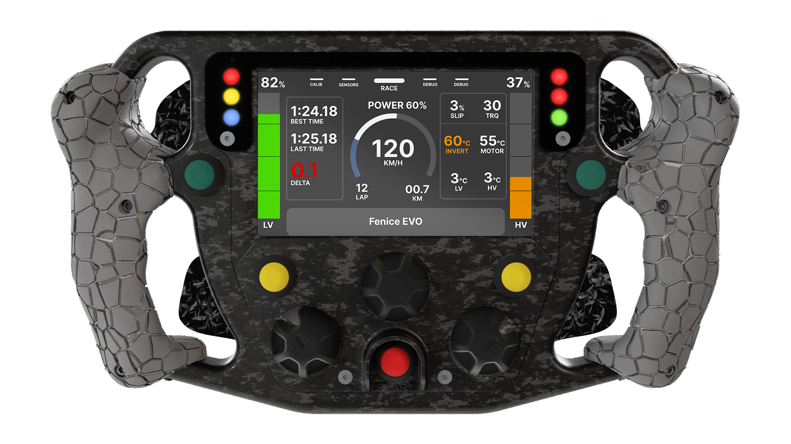

# Steering Wheel - Firmware



Steering wheel firmware of the E-Agle TRT car <em>Fenice Evo</em>, running the **Kraken** steering-wheel codebase ported to this single-core platform.

It works on a **STM32H723ZG** microcontroller placed on a custom PCB.

## Overview

The firmware is responsible for reading data from the **CAN bus** and displaying it on an **800x480 LCD** and **6 RGB LEDs**.
It also handles **buttons** and **3 rotary switches (manettini)** for user input in real-time, allowing the driver to interact with the system while driving.

## Codebase structure

- `Core/Src/steering/`, `Core/Inc/steering/`: hardware-agnostic application modules (FSM, inputs, parameters, LEDs, CAN communications, dashboard/popup/screen UI).
- `Core/Src/steering/drivers/`, `Core/Inc/steering/drivers/`: hardware-agnostic device drivers (MCP23017 GPIO expander, KTD2052 LED controller, Micron SDRAM).
- Everything else in `Core/` is CubeMX-generated peripheral code; the hardware glue that wires peripherals to the application modules lives in its user-code sections.

## Development

The codebase is based on **PlatformIO** and can be built and flashed using the following commands:

- First make sure you have **PlatformIO** installed:
    ```bash
    pip install platformio
    ```
- To build the firmware run this command:
    ```bash
    pio run
    ```
- To flash the firmware on the device, connect it to your computer and run this command:
    ```bash
    pio run -t upload
    ```

## Mantainers

- [Bridi Alessandro](https://github.com/bridiro)

## Licence

This repository is released under GNU AFFERO GENERAL PUBLIC LICENSE Version 3. See [LICENSE](./LICENSE) for more details.
